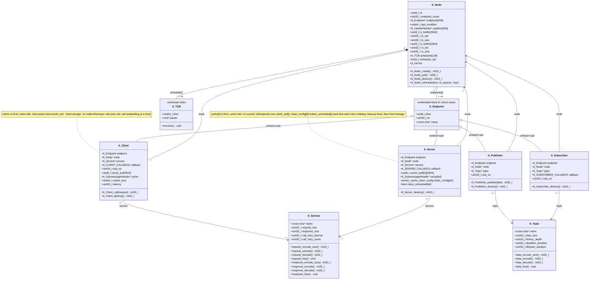
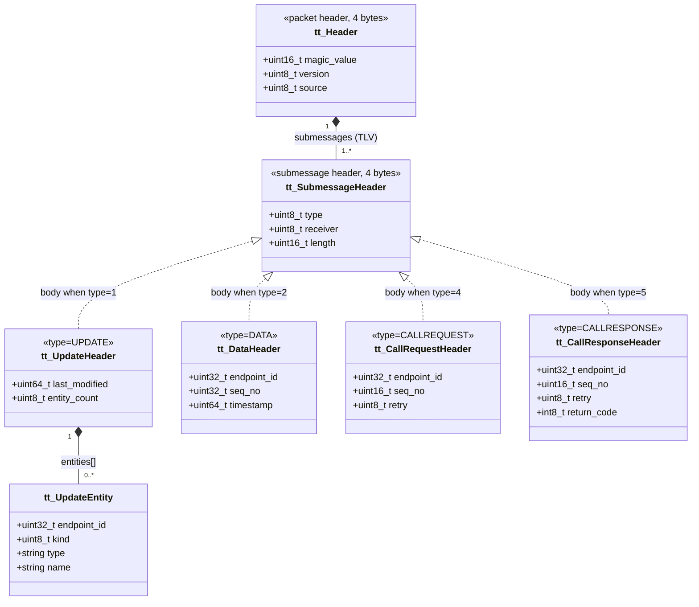
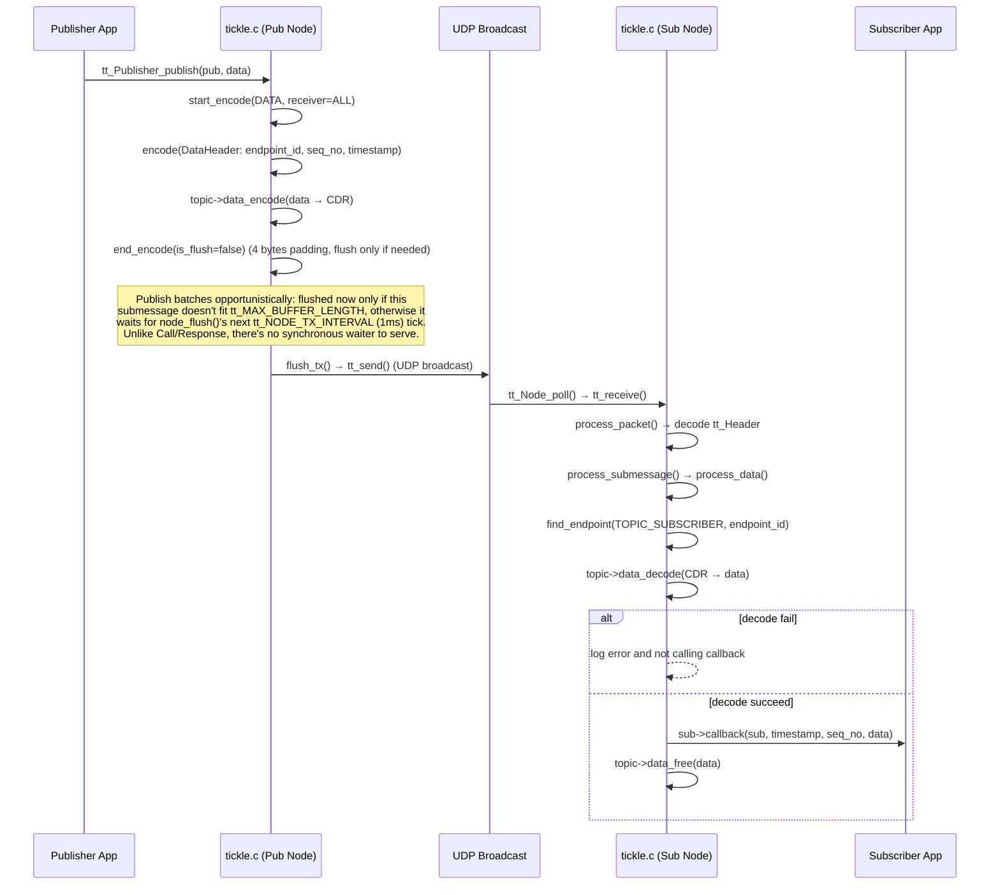
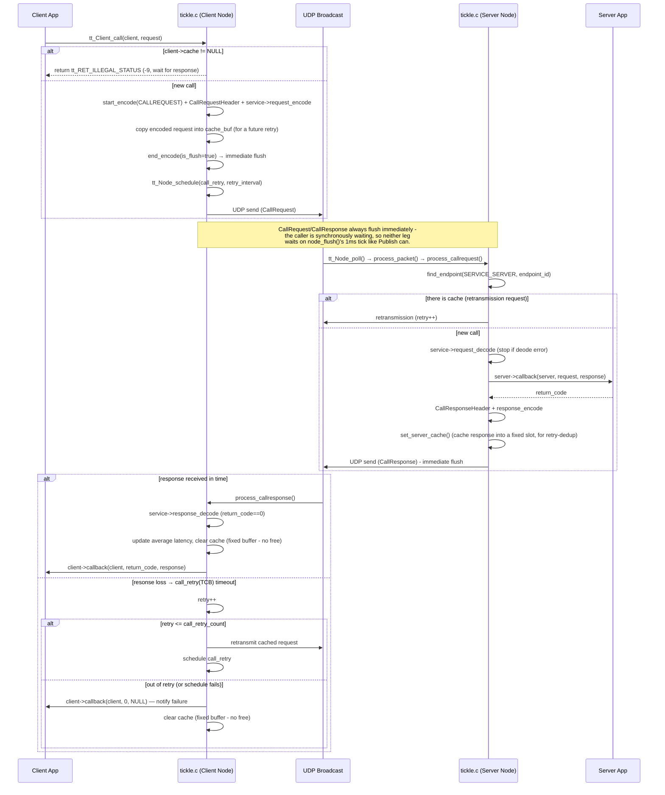

# Class Diagrams
## Runtime Class Diagram


## Protocol Class Diagram


# Sequence Diagrams
## Publish Sequence Diagram


### Call Sequence Diagram


# Performance & Reliability Decisions

A few internal choices exist specifically to keep tail latency and syscall/CPU overhead down.
Noted here since the reasoning isn't obvious from reading any single function in isolation.

## I/O waiting: `poll()`, not `SO_RCVTIMEO`

`tt_receive()` waits for socket readability with `poll()` instead of blocking on `recvfrom()`
with a per-call `SO_RCVTIMEO`. The wait timeout tracks whatever scheduled event
(`tt_Node_schedule()`) is due next, so it changes on nearly every call; re-arming
`SO_RCVTIMEO` via `setsockopt()` that often was pure overhead - measured at ~1255
`setsockopt()` calls for just 30 RPC round trips - for no benefit, since `poll()` takes the
timeout as a plain argument instead. This also sidesteps a real correctness bug the old
approach had: a sub-microsecond nanosecond timeout truncated to `struct timeval{0, 0}` when
converted, and the kernel treats `{0, 0}` as "block forever" for `SO_RCVTIMEO`, not "return
immediately" - the root cause of both an inflated per-request latency and full hangs whenever a
peer disappeared mid-run.

## RPC flushes immediately; Publish batches

`tt_Client_call()`, `call_retry()`, and the server's response send all pass `is_flush=true` to
`end_encode()`: the caller (or the peer waiting on a reply) is synchronously blocked, so
neither leg of an RPC round trip can be left sitting in `tx_buffer` until `node_flush()`'s next
`tt_NODE_TX_INTERVAL` (1ms) tick. `tt_Publisher_publish()` and the periodic `node_update()`
announce still pass `is_flush=false` - pub/sub has no synchronous waiter, so opportunistic
batching (flush only once the buffer would otherwise overflow) is free efficiency with no
latency cost to anyone. This one change dropped measured RPC round-trip latency by ~6.7x (rtt
avg 1.451ms → 0.217ms on the `ping`/`pong` example).

## Fixed-size caches, not `malloc`/`free`

Both `tt_Client.cache` (the one outstanding call) and `tt_Server.cache[]` (up to
`tt_MAX_SERVER_CACHE_COUNT` cached responses, for retry-dedup) are backed by fixed buffers
embedded in the struct (`cache_buf`/`cache_buf[][]`) instead of `malloc()`ing one per
call/response. Both are naturally bounded already (one outstanding call per client; a fixed
slot count per server), so going static adds no unbounded-growth risk - just a larger
`sizeof(struct tt_Server)` (~188KB, dominated by `cache_buf[64][tt_MAX_BUFFER_LENGTH * 2]`),
traded for zero heap churn on the RPC hot path and one less failure mode (no allocation-failure
branch to handle).

## Logging conventions

- `TT_LOG_DEBUG`/`INFO`/`WARNING`/`ERROR` check `tt_current_log_level` *before* calling through
  to `tt_log_debug()` etc., so a suppressed call costs one comparison instead of a full
  variadic call with its format-string arguments already evaluated. `process_packet()`'s decode
  path alone has ~28 `TT_LOG_DEBUG` call sites hit on nearly every received packet, so this
  matters at the default `TT_LOG_INFO` level (measured ~20% less CPU time on a saturated
  receiver). `.clang-tidy` sets `readability-function-cognitive-complexity.IgnoreMacros: true`
  because of the `if` this adds at every call site.
- Never use `perror()` - it bypasses `tt_log_set_output()`/`tt_log_set_level()` entirely (can't
  be redirected or silenced) and doesn't share the timestamp/level formatting the rest of the
  library uses. Use `TT_LOG_ERROR(..., strerror(errno))` for the same information instead.
- A callee that already logs its own specific reason for failing should not have its caller log
  a second, generic message on top of that ("ERROR on data" stacked on top of "Cannot decode
  data for endpoint_id: ..." doesn't add information, just noise).
- "Received malformed/undecodable data from a peer" is logged at `ERROR`, consistently, even
  though the receiving node itself is otherwise healthy - it's still worth an operator's
  attention. "A shared buffer is temporarily full" is `WARNING` when the caller already retries
  automatically (`call_retry()`) or exposes a distinct return code the caller is expected to
  handle gracefully (`tt_RET_OUT_OF_BUFFER` from `tt_Publisher_publish()`).

# Hardware-in-the-Loop CI Architecture

Every push to `main` measures real latency/throughput on physical hardware rather than trusting
a simulated or loopback test - the whole point of a protocol whose stated target is a specific
physical medium (10Base-T1S). See the README's "Continuous performance testing" section for
what it does; this is the *why* behind how it's wired together.

## Topology: orchestrator + two fixed-role DUTs

```
GitHub Actions (cloud)
        |  outbound long-poll (runner dials out; no inbound port needed)
        v
[self-hosted runner, label "tickle-hil"]
        |  SSH (dedicated "ci" account + key, not the operator's own login)
        +----------------+----------------+
        v                                 v
  rpi#1 (client role)              rpi#2 (server role)
  ping / client / publisher        pong / server / subscriber
  / perf_client                    / perf_server
        \_______________ 192.168.10.x test link _______________/
```

The runner never compiles anything or touches the 192.168.10.x link itself - it only dials out
to GitHub and SSHes into the two Pis, which build and run the actual example binaries under
test. That split means the runner's own OS/arch is irrelevant to the measurement, and a
flaky/overloaded runner can't skew a latency result the way it could if the runner *were* one
of the DUTs. Currently the runner is registered on the operator's own development machine
rather than a dedicated third machine - a deliberate simplification for now (one less thing to
provision), revisitable later if that machine's own load ever becomes a concern for
measurement stability; the SSH-key/account boundary to the two Pis already doesn't depend on
which machine the runner happens to live on.

## Why SSH + a plain shell script, not a HIL framework

Labgrid/LAVA/tbot-style device farms solve a harder problem (many boards, flashing images,
serial console capture) than two already-imaged, already-networked Linux boards that just need
a commit checked out and a binary run. `.github/scripts/run_perf.sh` doing
`git fetch && git reset --hard <sha>` + `make` + SSH-launch-and-collect over plain SSH is the
whole mechanism - reused as-is for local debugging outside CI, and with no framework-specific
knowledge required to change it.

## Debounce via `concurrency`, not a cron job

The original ask was "run on push, or after 5 minutes of commit inactivity." Rather than a
separate scheduled workflow, `performance.yml` relies on
`concurrency: {group: perf-main, cancel-in-progress: true}`: a burst of pushes just cancels
each earlier in-progress run as a newer one starts, so only the latest commit's run ever
actually reaches the hardware. (An earlier version of this workflow added a `sleep 300` before
the real work to explicitly wait out 5 minutes of inactivity; dropped once immediate
per-push feedback turned out to matter more than debouncing here.)

## Security: no `pull_request` trigger, ever

`tsnlab/tickle` is a public repository. A self-hosted runner triggered by `pull_request` (or
`pull_request_target`) would let anyone opening a PR from a fork run arbitrary code on hardware
this project's own SSH key can reach - a well-known self-hosted-runner risk on public repos.
`performance.yml` triggers only on `push` (to `main`, which only trusted collaborators can push
to) and `workflow_dispatch`. This is a hard rule for any future workflow using the
`tickle-hil` runner label, not just this one.

## Dedicated non-privileged accounts on the DUTs

Each Pi has its own `ci` account (not the operator's personal login) that the runner's SSH key
is scoped to: a separate, freshly generated key (not reused from anywhere else), the account is
not in `sudo`/`wheel`, and password login is disabled (`passwd -l`) so the key is the only way
in. Compromise of the CI pipeline this way is contained to "can rebuild and run tickle example
binaries as an unprivileged user," not "has the operator's own shell access."
