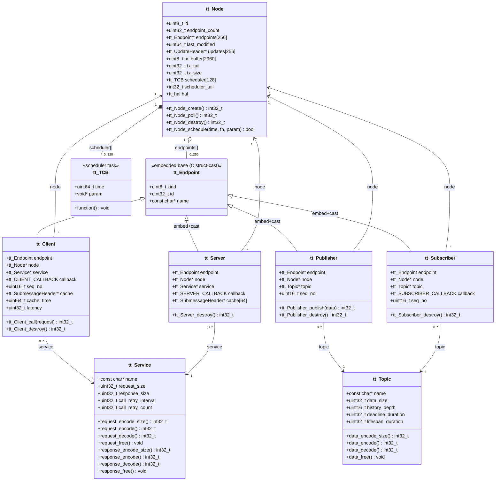
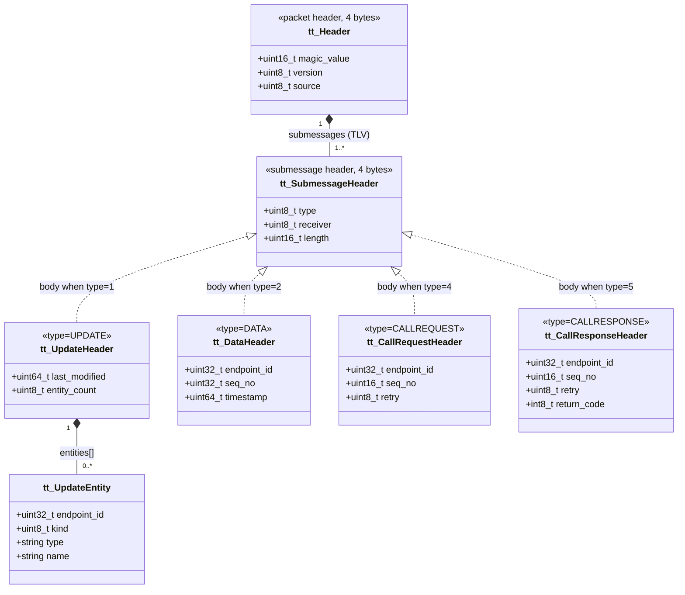
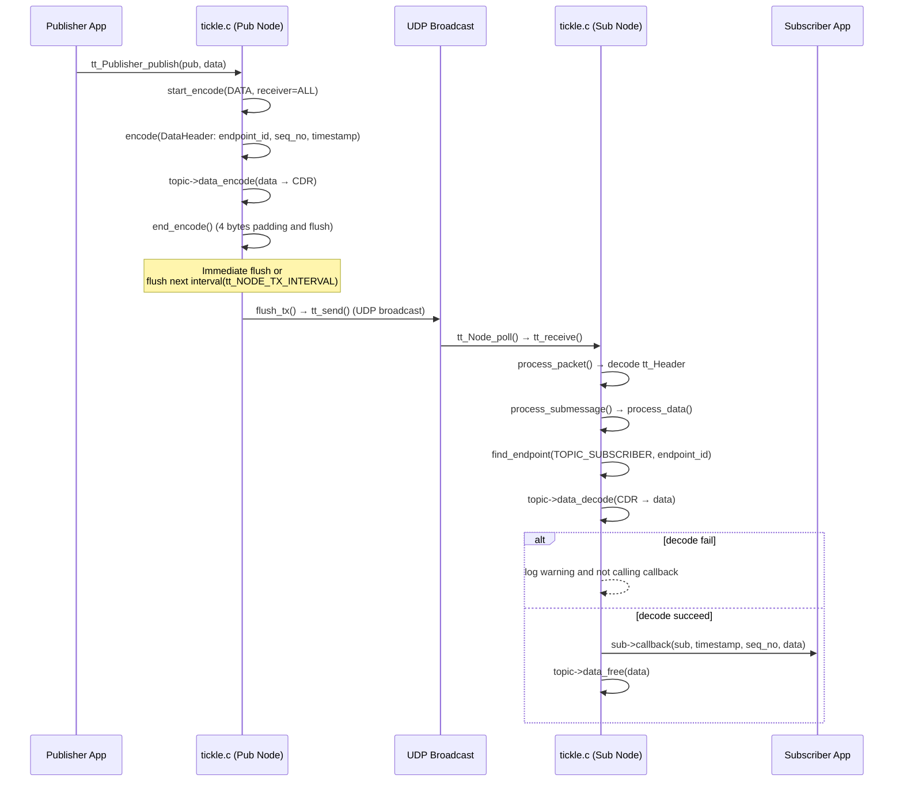
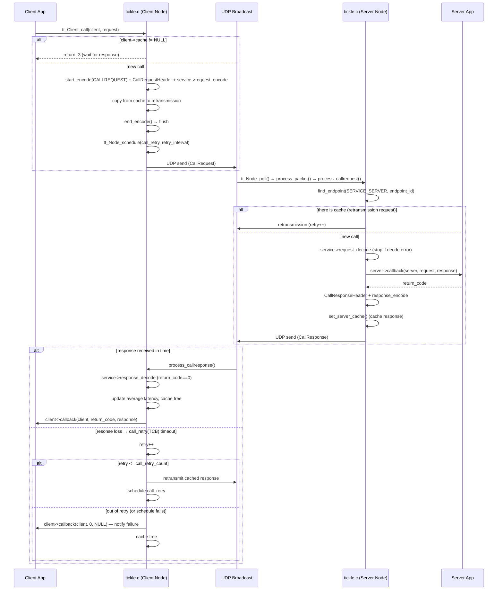

# Class Diagrams
## Runtime Class Diagram

```mermaid
classDiagram
    class tt_Node {
        +uint8_t id
        +uint32_t endpoint_count
        +tt_Endpoint* endpoints[256]
        +uint64_t last_modified
        +tt_UpdateHeader* updates[256]
        +uint8_t tx_buffer[2960]
        +uint32_t tx_tail
        +uint32_t tx_size
        +tt_TCB scheduler[128]
        +int32_t scheduler_tail
        +tt_hal hal
        +tt_Node_create() int32_t
        +tt_Node_poll() int32_t
        +tt_Node_destroy() int32_t
        +tt_Node_schedule(time, fn, param) bool
    }

    class tt_Endpoint {
        <<embedded base (C struct-cast)>>
        +uint8_t kind
        +uint32_t id
        +const char* name
    }

    class tt_Client {
        +tt_Endpoint endpoint
        +tt_Node* node
        +tt_Service* service
        +tt_CLIENT_CALLBACK callback
        +uint16_t seq_no
        +tt_SubmessageHeader* cache
        +uint64_t cache_time
        +uint32_t latency
        +tt_Client_call(request) int32_t
        +tt_Client_destroy() int32_t
    }

    class tt_Server {
        +tt_Endpoint endpoint
        +tt_Node* node
        +tt_Service* service
        +tt_SERVER_CALLBACK callback
        +tt_SubmessageHeader* cache[64]
        +tt_Server_destroy() int32_t
    }

    class tt_Publisher {
        +tt_Endpoint endpoint
        +tt_Node* node
        +tt_Topic* topic
        +uint16_t seq_no
        +tt_Publisher_publish(data) int32_t
        +tt_Publisher_destroy() int32_t
    }

    class tt_Subscriber {
        +tt_Endpoint endpoint
        +tt_Node* node
        +tt_Topic* topic
        +tt_SUBSCRIBER_CALLBACK callback
        +uint16_t seq_no
        +tt_Subscriber_destroy() int32_t
    }

    class tt_Service {
        +const char* name
        +uint32_t request_size
        +uint32_t response_size
        +request_encode_size() int32_t
        +request_encode() int32_t
        +request_decode() int32_t
        +request_free() void
        +response_encode_size() int32_t
        +response_encode() int32_t
        +response_decode() int32_t
        +response_free() void
        +uint32_t call_retry_interval
        +uint32_t call_retry_count
    }

    class tt_Topic {
        +const char* name
        +uint32_t data_size
        +data_encode_size() int32_t
        +data_encode() int32_t
        +data_decode() int32_t
        +data_free() void
        +uint16_t history_depth
        +uint32_t deadline_duration
        +uint32_t lifespan_duration
    }

    class tt_TCB {
        <<scheduler task>>
        +uint64_t time
        +function() void
        +void* param
    }

    tt_Endpoint <|-- tt_Client : embed+cast
    tt_Endpoint <|-- tt_Server : embed+cast
    tt_Endpoint <|-- tt_Publisher : embed+cast
    tt_Endpoint <|-- tt_Subscriber : embed+cast

    tt_Node "1" o-- "0..256" tt_Endpoint : endpoints[]
    tt_Node "1" *-- "0..128" tt_TCB : scheduler[]
    tt_Client "0..*" --> "1" tt_Service : service
    tt_Server "0..*" --> "1" tt_Service : service
    tt_Publisher "0..*" --> "1" tt_Topic : topic
    tt_Subscriber "0..*" --> "1" tt_Topic : topic
    tt_Client "*" --> "1" tt_Node : node
    tt_Server "*" --> "1" tt_Node : node
    tt_Publisher "*" --> "1" tt_Node : node
    tt_Subscriber "*" --> "1" tt_Node : node
```

## Protocol Class Diagram

```mermaid
classDiagram
    class tt_Header {
        <<packet header, 4 bytes>>
        +uint16_t magic_value
        +uint8_t version
        +uint8_t source
    }

    class tt_SubmessageHeader {
        <<submessage header, 4 bytes>>
        +uint8_t type
        +uint8_t receiver
        +uint16_t length
    }

    class tt_UpdateHeader {
        <<type=UPDATE>>
        +uint64_t last_modified
        +uint8_t entity_count
    }

    class tt_UpdateEntity {
        +uint32_t endpoint_id
        +uint8_t kind
        +string type
        +string name
    }

    class tt_DataHeader {
        <<type=DATA>>
        +uint32_t endpoint_id
        +uint32_t seq_no
        +uint64_t timestamp
    }

    class tt_CallRequestHeader {
        <<type=CALLREQUEST>>
        +uint32_t endpoint_id
        +uint16_t seq_no
        +uint8_t retry
    }

    class tt_CallResponseHeader {
        <<type=CALLRESPONSE>>
        +uint32_t endpoint_id
        +uint16_t seq_no
        +uint8_t retry
        +int8_t return_code
    }

    tt_Header "1" *-- "1..*" tt_SubmessageHeader : submessages (TLV)
    tt_SubmessageHeader <|.. tt_UpdateHeader : body when type=1
    tt_SubmessageHeader <|.. tt_DataHeader : body when type=2
    tt_SubmessageHeader <|.. tt_CallRequestHeader : body when type=4
    tt_SubmessageHeader <|.. tt_CallResponseHeader : body when type=5
    tt_UpdateHeader "1" *-- "0..*" tt_UpdateEntity : entities[]
```

# Sequence Diagrams
## Publish Sequence Diagram

```mermaid
sequenceDiagram
    participant PubApp as Publisher App
    participant PubTickle as tickle.c (Pub Node)
    participant Net as UDP Broadcast
    participant SubTickle as tickle.c (Sub Node)
    participant SubApp as Subscriber App

    PubApp->>PubTickle: tt_Publisher_publish(pub, data)
    PubTickle->>PubTickle: start_encode(DATA, receiver=ALL)
    PubTickle->>PubTickle: encode(DataHeader: endpoint_id, seq_no, timestamp)
    PubTickle->>PubTickle: topic->data_encode(data → CDR)
    PubTickle->>PubTickle: end_encode() (4 bytes padding and flush)
    Note over PubTickle: Immediate flush or<br/>flush next interval(tt_NODE_TX_INTERVAL)
    PubTickle->>Net: flush_tx() → tt_send() (UDP broadcast)

    Net->>SubTickle: tt_Node_poll() → tt_receive()
    SubTickle->>SubTickle: process_packet() → decode tt_Header
    SubTickle->>SubTickle: process_submessage() → process_data()
    SubTickle->>SubTickle: find_endpoint(TOPIC_SUBSCRIBER, endpoint_id)
    SubTickle->>SubTickle: topic->data_decode(CDR → data)
    alt decode fail
        SubTickle-->>SubTickle: log warning and not calling callback
    else decode succeed
        SubTickle->>SubApp: sub->callback(sub, timestamp, seq_no, data)
        SubTickle->>SubTickle: topic->data_free(data)
    end
```

### Call Sequence Diagram

```mermaid
sequenceDiagram
    participant ClientApp as Client App
    participant ClientTickle as tickle.c (Client Node)
    participant Net as UDP Broadcast
    participant ServerTickle as tickle.c (Server Node)
    participant ServerApp as Server App

    ClientApp->>ClientTickle: tt_Client_call(client, request)
    alt client->cache != NULL
        ClientTickle-->>ClientApp: return -3 (wait for response)
    else new call
        ClientTickle->>ClientTickle: start_encode(CALLREQUEST) + CallRequestHeader + service->request_encode
        ClientTickle->>ClientTickle: copy from cache to retransmission
        ClientTickle->>ClientTickle: end_encode() → flush
        ClientTickle->>ClientTickle: tt_Node_schedule(call_retry, retry_interval)
        ClientTickle->>Net: UDP send (CallRequest)
    end

    Net->>ServerTickle: tt_Node_poll() → process_packet() → process_callrequest()
    ServerTickle->>ServerTickle: find_endpoint(SERVICE_SERVER, endpoint_id)
    alt there is cache (retransmission request)
        ServerTickle->>Net: retransmission (retry++)
    else new call
        ServerTickle->>ServerTickle: service->request_decode (stop if deode error)
        ServerTickle->>ServerApp: server->callback(server, request, response)
        ServerApp-->>ServerTickle: return_code
        ServerTickle->>ServerTickle: CallResponseHeader + response_encode
        ServerTickle->>ServerTickle: set_server_cache() (cache response)
        ServerTickle->>Net: UDP send (CallResponse)
    end

    alt response received in time
        Net->>ClientTickle: process_callresponse()
        ClientTickle->>ClientTickle: service->response_decode (return_code==0)
        ClientTickle->>ClientTickle: update average latency, cache free
        ClientTickle->>ClientApp: client->callback(client, return_code, response)
    else resonse loss → call_retry(TCB) timeout
        ClientTickle->>ClientTickle: retry++ 
        alt retry <= call_retry_count
            ClientTickle->>Net: retransmit cached response
            ClientTickle->>ClientTickle: schedule call_retry
        else out of retry (or schedule fails)
            ClientTickle->>ClientApp: client->callback(client, 0, NULL) — notify failure
            ClientTickle->>ClientTickle: cache free
        end
    end
```
