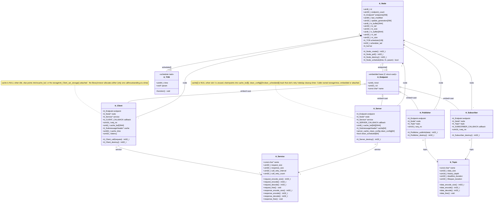
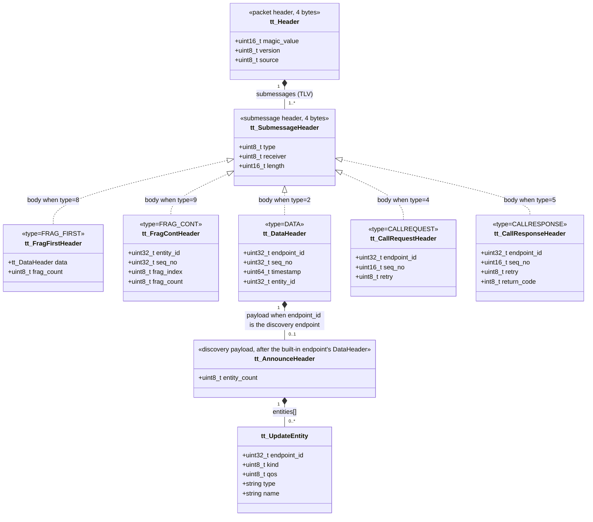
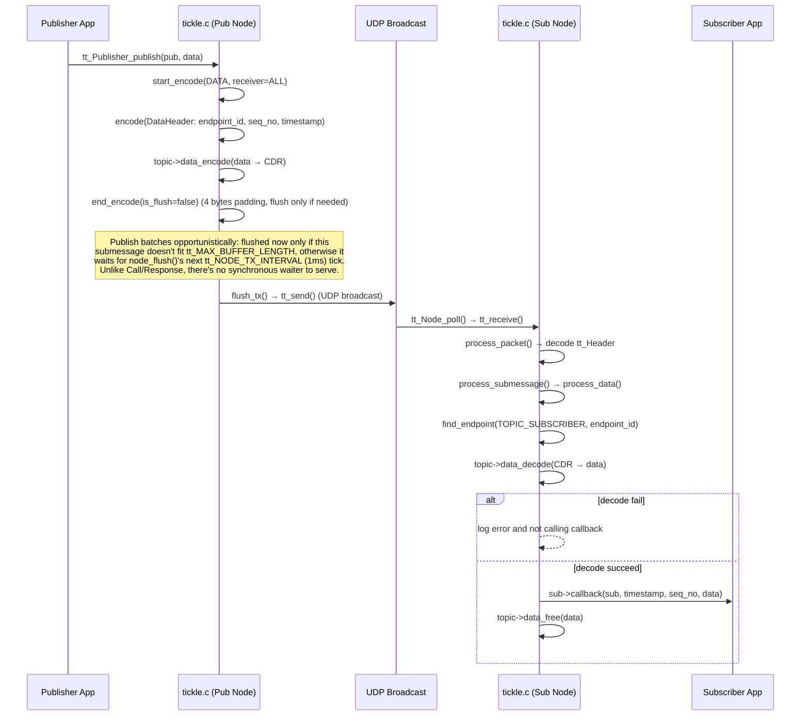
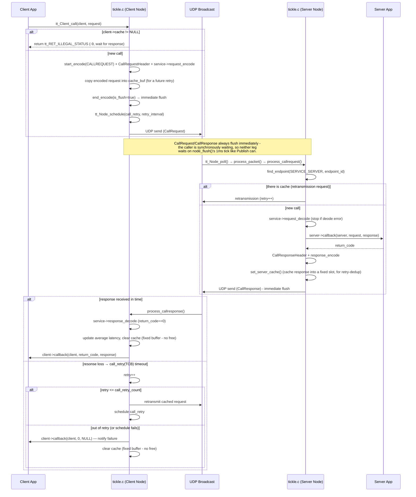

# Class Diagrams
## Runtime Class Diagram


## Protocol Class Diagram


# Sequence Diagrams
## Publish Sequence Diagram


### Call Sequence Diagram


# Wire Protocol

This chapter is the specification of what TickLE puts on the wire, as of `tt_VERSION` 9. The decision
sections further down explain *why* each part looks as it does; this chapter says *what* it is, in one
place. The structs named here are in `include/tickle/tickle.h`, and they are the authority if this text
and the code ever disagree.

## Transport and addressing

- **UDP over IPv4.** Every node has two sockets:
  - the **well-known socket**, bound to the wildcard address on the well-known port (`_tt_NODE_PORT`,
    8282 by default), which receives broadcasts;
  - the **data socket**, bound to the node's address on its own port, which sends everything and receives
    unicast. A peer's unicast address is learned from the source address of its datagrams.
- **Broadcast**, to the configured link broadcast address (`_tt_CONFIG.broadcast`, the limited broadcast
  `255.255.255.255` by default). It carries discovery, and data for a publisher that has no peers or
  more than `tt_UNICAST_PEER_THRESHOLD` (2) of them. Otherwise a publisher's data is unicast to each
  learned subscriber ("Discovery-learned peers" below).
- **Datagram size:** at most `tt_MAX_BUFFER_LENGTH` bytes of UDP payload, 1472 by default (a standard
  Ethernet MTU with no IP fragmentation). A sample larger than that is split by TickLE itself
  (`FRAG_FIRST`/`FRAG_CONT`), never by the IP layer.

## Datagram layout

A datagram is one `tt_Header` followed by one or more submessages, each a type-length-value record:

```
+--------------------------------------------------------------+
| tt_Header (4 B): magic[2] "KT" (LE) / "TK" (BE) | version | source |
+--------------------------------------------------------------+
| tt_SubmessageHeader (4 B): type | receiver | length (bytes)   |
| body: a type-specific header, then the payload (CDR-4)      |
| ... padded so the next submessage starts 4-byte aligned      |
+--------------------------------------------------------------+
| next submessage ...                                          |
+--------------------------------------------------------------+
```

- `magic` gives the sender's byte order. Senders write native order; receivers swap ("Byte order" below).
- `version` is `tt_VERSION`. A datagram of another version is dropped, and the mismatch is logged once
  per remote node.
- `source` is the sending node's ID (1-254; 0 is `tt_NODE_ID_INVALID`).
- `receiver` is the destination node ID, or `tt_SUBMESSAGE_ID_ALL` (0xff) for every node.
- `length` is the whole submessage in **bytes**, header included, normally padded to a multiple of 4. It
  is the offset to the next submessage. It is not a count of 4-byte words.

## Submessages

| type | name | body header | size | purpose |
|---:|---|---|---:|---|
| 1 | *(retired: UPDATE)* | - | - | never reused |
| 2 | `DATA` | `tt_DataHeader`: endpoint_id, seq_no, timestamp, entity_id | 20 B | one sample in one datagram |
| 3 | `ACKNACK` | `tt_AckNackHeader`: endpoint_id, entity_id, sender_entity_id, seq_no, bitmap_words, bitmap[] | 20 + 8 × words B | a reader's cumulative ack plus a bitmap of what it is missing |
| 4 | `CALLREQUEST` | `tt_CallRequestHeader`: endpoint_id, seq_no (16-bit), retry, reserved | 8 B | a service request |
| 5 | `CALLRESPONSE` | `tt_CallResponseHeader`: endpoint_id, seq_no, retry, return_code | 8 B | its response |
| 6 | `HEARTBEAT` | `tt_HeartbeatHeader`: endpoint_id, first_available_seq_no, last_seq_no, entity_id, flags, pad | 20 B | a writer's range, soliciting ACKNACKs; with `tt_HEARTBEAT_FLAG_LIVELINESS` (flags bit 1) only a MANUAL_BY_TOPIC writer's liveliness assertion |
| 7 | *(retired: UPDATE_PART)* | - | - | never reused |
| 8 | `FRAG_FIRST` | `tt_FragFirstHeader`: a whole `tt_DataHeader` + frag_count | 21 B | first datagram of a fragmented sample |
| 9 | `FRAG_CONT` | `tt_FragContHeader`: entity_id, seq_no, frag_index, frag_count | 10 B | every later datagram of it |

`FRAG_FIRST` and `FRAG_CONT` are not padded, so a fragment's payload starts right after its header.

**Identifiers.**
- `endpoint_id` is a 32-bit hash of the topic or service name and the endpoint name. Every instance of an
  endpoint on a node shares it.
- `entity_id` identifies one instance within its node; the pair (source node, entity_id) identifies a
  writer network-wide.
- `seq_no` is per writer and **per datagram**: a sample of k fragments uses k consecutive numbers
  (`DATAFRAG_PLAN.md` §13). Loss recovery works per datagram, through ACKNACK's bitmap of
  `tt_RELIABLE_BITMAP_WORDS` 64-bit words.

## Built-in discovery endpoint (`tt_DISCOVERY_ENDPOINT_ID` 0)

Discovery is ordinary traffic on a built-in endpoint (endpoint_id 0, entity_id `tt_DISCOVERY_ENTITY_ID`),
in the RTPS arrangement, rather than message types of its own:

| role | submessage | addressed | contents |
|---|---|---|---|
| summary, every interval (1 s, or a sixth of the node's shortest own lease if sooner) | HEARTBEAT | broadcast | `first_available_seq_no = last_seq_no` = the node's generation (low 32 bits of `last_modified`) |
| request for the list | ACKNACK | unicast to the summary's sender | `seq_no` = the generation wanted |
| the list | DATA / FRAG_FIRST+FRAG_CONT | unicast to the requester | `tt_AnnounceHeader` + `tt_UpdateEntity` records |
| a change (endpoint created or destroyed) | the list | broadcast, at once | the new generation |

- A changed list heard by broadcast is answered once with the receiver's own list, unicast.
- An unanswered request is re-sent every `tt_DISCOVERY_REQUEST_RETRY` (10 ms), up to
  `tt_DISCOVERY_REQUEST_ATTEMPTS` times.
- A large list is fragmented **at entity boundaries**. Every fragment carries its own `tt_AnnounceHeader`
  and whole entities, so it is applied as it arrives, with no reassembly memory.
- Every datagram refreshes the sender's liveliness. A node is presumed gone after
  `tt_LIVELINESS_SILENCE_NS` (3.5 intervals) of silence - longer if one of its entities announced a
  longer lease, up to `tt_NODE_MAX_LEASE_NS` (10 s) - or on its goodbye (its list broadcast at destroy).
  See "Liveliness" below.
- The detail and the reasons are in "Discovery announce: a DATA of a built-in endpoint" below and in
  `rmw_tickle/DISCOVERY_PLAN.md`.

## Payload

- Sample payloads are TickLE CDR-4 ("Interface serialization" below), which caps alignment at 4.
- `rmw_tickle` prefixes each sample with its own 8-byte publication sequence number: the ROS sample
  number, distinct from the core's per-datagram `seq_no`.

## Versioning rule

`tt_VERSION` changes whenever a byte on the wire changes meaning, including a new use of an existing
submessage or flag. There is no partial compatibility: two versions do not talk, and the mismatch is
logged. Numbers of retired types are never reused. History:
- 5: ACKNACK bitmap widened.
- 6: a per-subscriber ack identity (ACKNACK `sender_entity_id`) and a wider window.
- 7: discovery became a DATA of a built-in endpoint; UPDATE/UPDATE_PART retired.
- 8: periodic summary and pulled list.
- 9: `tt_HEARTBEAT_FLAG_LIVELINESS`, a MANUAL_BY_TOPIC writer's liveliness assertion
  (`rmw_tickle/LIVELINESS_PLAN.md`).

## Per-datagram overhead, the baseline for wire optimisation

Framing bytes on the wire besides the payload, for one sample in one datagram:

| layer | bytes |
|---|---:|
| Ethernet + IPv4 + UDP (outside TickLE's control) | 14 + 20 + 8 = 42 |
| `tt_Header` | 4 |
| `tt_SubmessageHeader` | 4 |
| `tt_DataHeader` | 20 |
| rmw_tickle's publication sequence number (rmw only) | 8 |
| **TickLE framing, core / rmw** | **28 / 36** |

`COMPARISON.md` row 41 measures the whole on-wire cost per sample against FastDDS and CycloneDDS. Any
change to this chapter's formats follows `rmw_tickle/WIRE_PLAN.md`: a wire change must leave every test
better than before (the user's rule of 2026-09-26).

# Performance & Reliability Decisions

A few internal choices exist specifically to keep tail latency and syscall/CPU overhead down.
Noted here since the reasoning isn't obvious from reading any single function in isolation.

## I/O waiting: `poll()`, not `SO_RCVTIMEO`

`tt_receive()` waits for socket readability with `poll()` instead of blocking on `recvfrom()`
with a per-call `SO_RCVTIMEO`. The wait timeout tracks whatever scheduled event
(`tt_Node_schedule()`) is due next, so it changes on nearly every call; re-arming
`SO_RCVTIMEO` via `setsockopt()` that often was pure overhead - measured at ~1255
`setsockopt()` calls for just 30 RPC round trips - for no benefit, since `poll()` takes the
timeout as a plain argument instead. This also sidesteps a real correctness bug the old
approach had: a sub-microsecond nanosecond timeout truncated to `struct timeval{0, 0}` when
converted, and the kernel treats `{0, 0}` as "block forever" for `SO_RCVTIMEO`, not "return
immediately" - the root cause of both an inflated per-request latency and full hangs whenever a
peer disappeared mid-run.

## RPC and Publish flush immediately by default; batching is opt-in

`tt_Client_call()`, `call_retry()`, and the server's response send all pass `is_flush=true` to
`end_encode()` unconditionally: the caller (or the peer waiting on a reply) is synchronously
blocked, so neither leg of an RPC round trip can be left sitting in `tx_buffer` until
`node_flush()`'s next `tt_NODE_TX_INTERVAL` (1ms) tick. This one change dropped measured RPC
round-trip latency by ~6.7x (rtt avg 1.451ms → 0.217ms on the `ping`/`pong` example).

`tt_Publisher_publish()` mirrors this as its own *default* now (`tt_Publisher.batch == false`,
set by `tt_Node_create_publisher()`) - measured on a real `rmw_tickle` round trip (`rmw_tickle/
PLAN.md`'s `rmw-perf.yml` benchmark, a realistic ~1000 msg/s ROS 2 publish rate), dropping average
two-process latency ~9x (0.44ms → 0.048ms), bringing it within ~1.5x of `rmw_fastrtps_cpp`/
`rmw_cyclonedds_cpp` on the same rig (was ~13x slower before), with zero measured message loss.
The periodic `node_update()` announce still always batches (`is_flush=false` unconditionally) -
it's not latency-sensitive (nothing synchronously waits on it), and this is also what a batching
Publisher's own deferred flush and this announce safely share one buffer under
(`tx_has_pending_update`, see below).

This makes an immediate-flush Publisher's own peer decision (unicast once discovery has matched
`tt_UNICAST_PEER_THRESHOLD` or fewer Subscribers, same threshold/guard as below) fire on every
`tt_Publisher_publish()` call instead of only at `node_flush()`'s own tick - **the "Discovery-
learned peers" section right below documents a real, pre-existing risk this inherits unchanged,
not one this introduces**: an *uncapped-rate* Publisher (`perf_client.c`'s own `-i 0` default, no
rate limit) switching from broadcast to per-message unicast once discovery completes can outrun a
receiver's own UDP socket buffer once self-receive no longer throttles the sender (measured on
real hardware: ~95% receive collapse). Confirmed this session that a realistic, *rate-limited*
publish loop (`rmw_tickle`'s own ~1000 msg/s above) doesn't reproduce it - the risk is specific to
letting a Publisher run genuinely as fast as `tt_Node_poll()` allows, which was already true of
`node_flush()`'s own existing unicast decision before this change, not new here.

Setting `pub->batch = true` on a specific `tt_Publisher` opts it back into the pre-existing
behavior instead: never flush from `tt_Publisher_publish()` itself, defer to `node_flush()`'s own
tick exactly as every Publisher did before this field existed. This matters for one real, if
unusual, case: a Publisher that calls `tt_Publisher_publish()` several times in a row for the same
destination benefits from coalescing those into fewer, larger packets - measured (not guessed) on
the same rig: a tight small-message (16-byte) stream's own achievable throughput fell ~4.4x
(1.60M msg/s → 0.37M msg/s) when forced to flush immediately, one packet per message, instead of
batching. A large message (close to `tt_MAX_BUFFER_LENGTH`, where at most one or two fit in
`tx_buffer` at once regardless) saw no such cost either way - batching only pays for itself when
several messages can actually share one packet. `examples/linux/perf/perf_client.c`'s own `-B`
flag is this same field exposed on the command line (`opts.batch` → `pub.batch`, `cli_opts.h`'s
`TT_EXAMPLE_OPT_BATCH`) - the reproducible way to see both sides of this number directly: an
uncapped (`-i 0`), small (`-s 16`) flood loses far more than throughput without it. On this same
dev-server rig, the *default* (no `-B`) didn't just send slower - once discovery matched the lone
`perf_server` and switched to per-message unicast, the receiver saw **100% loss** (1 in ~12,500
messages actually arriving), the "Discovery-learned peers" section below's own `-i 0`/uncapped-rate
caveat in concrete numbers; `-B` restored both throughput (~4x higher sent rate) and reliability
(0.7% loss) by coalescing that same flood into far fewer, larger packets.

## Discovery announce: a DATA of a built-in endpoint

A node announces its endpoints as a `DATA` sample of a built-in discovery endpoint, which is the
RTPS arrangement. Since `tt_VERSION` 7 (DATA_FRAG step 2, 2026-09-26) it is no longer a submessage
type of its own. `UPDATE` (type 1) and `UPDATE_PART` (type 7) are retired, and neither number is to
be reused.

**Wire.** The `tt_DataHeader` carries `endpoint_id = tt_DISCOVERY_ENDPOINT_ID` (0),
`entity_id = tt_DISCOVERY_ENTITY_ID` (all ones), `timestamp` = the node's `last_modified`, and
`seq_no` = the announce's **generation**, the low 32 bits of `last_modified`. The payload is
`tt_AnnounceHeader` (`entity_count`, u8) followed by that many `tt_UpdateEntity` records. Byte
order follows the packet header, as for every submessage. No user entity is ever given the
discovery `entity_id`; creation skips it.

The generation changes exactly when the endpoint list does, and differs across a restart. Those
are the only two things the receiver asks of it. It is carried because a `FRAG_CONT` carries
`seq_no` and not `timestamp`, and every fragment of an announce has to say which announce it
belongs to.

**Too large for one datagram.** When the list outgrows a datagram (about 15 endpoints with
ROS-sized names at 1472), it goes as `FRAG_FIRST`/`FRAG_CONT`, the same types user data uses. It is
split **at entity boundaries** rather than by bytes: every fragment carries its own
`tt_AnnounceHeader` and whole entities, and is processed as it arrives, with no reassembly memory.
That keeps what `UPDATE_PART` gave a node on core defaults (it can discover a node whose announce
spans datagrams without holding a reassembly buffer the size of the largest possible announce),
while the wire is one mechanism. A continuation is recognised as discovery by its `entity_id`.

**Sender.**
- An announce that fits one datagram is one `DATA`: broadcast when the endpoint list changes, and
  unicast when replying to first contact or to a request (see "The periodic summary" below).
- Otherwise the list is split greedily in endpoint order, each fragment its own datagram to the same
  destination. Fragments are planned with `FRAG_FIRST`'s larger header, so the plan holds wherever a
  fragment lands.
- An endpoint whose record alone could not fit a datagram is left out, logged and counted in
  `tt_Node.tx_dropped_oversize`. If what remains fits one datagram, it goes as a single `DATA`: a
  one-fragment announce is never sent.
- An announce needing more than 32 fragments is not sent at all, and is logged and counted.

**Receiver.**
- **Liveliness is refreshed first**, on every announce and every fragment, before anything can
  return, as it is on every summary. `test_update_parts.c` pins this with a control: it checks after
  every interval, because a node wrongly declared dead is re-learned from its very next summary and
  the end state alone would look healthy.
- The discovery endpoint has no Subscriber, no reliable tracking and no deduplication in front of
  it. The handler compares the generation itself: the one it last acted on is a resend and is
  ignored.
- A new generation replaces the source's old list as soon as its first datagram arrives, whole or
  any fragment: everything the source announced before is forgotten, then this is applied. Each
  fragment's entities are applied as they arrive, and a repeated fragment applies the same entities
  again, which is harmless because discovery upserts.
- Once every fragment has arrived, the announce becomes the source's acted-on one
  (`update_generation`/`update_seen`), unmatched ack state is dropped, and a first contact gets our
  own announce back.

**Lost fragment.** The announce stays incomplete, and the source is known by the fragments that did
arrive. Its generation is not applied, so the source's next summary draws a request, and the reply
resends every fragment under the same generation, which fills the gap without starting over. A
source heard only through an announce that never completed still expires by the ordinary liveliness
rule, since its entities are recorded all the same.

**Interop.** A version bump, not new types. The announce itself changed shape, so a node of
`tt_VERSION` 6 and one of 7 cannot understand each other's discovery. `validate_packet_header()`
rejects the other version outright, and logs that once per source, rather than letting either side
misread the other.

### The periodic summary, and the list pulled on demand (`tt_VERSION` 8)

Until `tt_VERSION` 8 the whole announce was broadcast every `tt_NODE_UPDATE_INTERVAL` (1 s), changed
or not: about 100-130 bytes per ROS endpoint, so a node's steady-state discovery traffic grew with
every endpoint on the network. Since 8 (2026-09-26, `rmw_tickle/DISCOVERY_PLAN.md`, the user's
decision) the list travels only when someone needs it, over the reliable protocol's own submessages
on the discovery endpoint:

| role | submessage | addressed | contents |
|---|---|---|---|
| summary, every interval | `HEARTBEAT` | broadcast | `first_available_seq_no = last_seq_no` = generation |
| request for the list | `ACKNACK` | unicast to the summary's sender | `seq_no` = the generation seen |
| the list | the announce above | unicast to the requester | the full endpoint list |
| a change | the announce above | broadcast, at once | the new generation |

- **A summary is ~28 bytes whatever the endpoint count.** It refreshes the sender's liveliness exactly
  as an announce does, so leases and `tt_NODE_UPDATE_INTERVAL` are unchanged.
- **A generation already applied** makes a summary liveliness only; nothing is sent back.
- **Any other generation** - a change whose broadcast was lost, a node that joined later, one that
  restarted, an announce left incomplete - draws one request. While the list has not arrived, the
  request is re-sent every `tt_DISCOVERY_REQUEST_RETRY` (10 ms), `tt_DISCOVERY_REQUEST_ATTEMPTS` (4)
  times in all; a summary arriving meanwhile adds nothing. After that the next summary starts over.
  A lost request or reply therefore costs milliseconds, not the rest of an interval, and nothing can
  storm: at most four requests per peer per summary. Open requests are kept in a fixed table of
  `tt_DISCOVERY_PENDING_REQUESTS` (8) slots served by one scheduler entry; a request that finds the
  table full is still sent, only not retried. Added after M5 (5% loss) saw a node wait 2 s for a list
  across two losses, where the first version re-asked only on the next summary.
- **A request is answered unicast**, up to `tt_UNICAST_PEER_THRESHOLD` in one `tt_NODE_TX_INTERVAL`
  tick. One more is answered by a single broadcast of the list, and the rest of that tick's requests
  by nothing further - so a burst of new nodes costs one broadcast, not one unicast each.
- **A change is still pushed** by broadcast the moment an endpoint is created or destroyed, and a
  node hearing a changed broadcast list, or an unknown node's, still answers with its own, as before.
  The pull only covers what the push missed.
- A request or answer goes out from an empty transmit buffer: anything batched there is flushed as
  the broadcast it was going to be.
- **A node is presumed dead after `tt_LIVELINESS_SILENCE_NS`** of silence: `tt_LIVELINESS_MISS_THRESHOLD`
  (3) intervals and half of one more, so exactly three missed summaries. The limit used to be a whole
  number of intervals, which put it where the next summary lands after only two losses; every node's
  periodic tasks run a little late and reschedule from when they ran, so the check and that summary
  drift across each other and either can come first. M5 showed it as false deaths at 5% loss, now that
  one summary a second is the only sign of life an idle node gives (a v7 announce of 32 endpoints was
  two datagrams, so it took twice the losses).

`tests/test_peer_discovery.c` checks each rule on two simulated nodes, with the loss that exercises
it, and each check was run against a code change that breaks its rule.

## Liveliness: the lease runs from the last sign of life (`tt_VERSION` 9)

Since 2026-09-26 (`rmw_tickle/LIVELINESS_PLAN.md`, the user's decision) liveliness follows DDS: a lease
runs from the entity's last sign of life, and the verdict is taken when it runs out.

- **What refreshes a lease.** For an AUTOMATIC entity, any datagram from its node: summary, announce,
  DATA, HEARTBEAT, ACKNACK (`tt_Node.traffic_last_seen`). For a MANUAL_BY_TOPIC Publisher, only its own
  DATA or a HEARTBEAT carrying `tt_HEARTBEAT_FLAG_LIVELINESS`, which `tt_Publisher_assert_liveliness()`
  sends. The discovery table has no entity_id, so a manual writer is found by (node, endpoint_id), and two
  writers of one endpoint on one node share that clock. The lookup runs only for a node that announced a
  leased manual Publisher (`tt_Node.liveliness_flags`), so other traffic pays a one-byte test.
- **When the verdict is taken.** One scheduler entry per node, `check_liveliness()`, runs at the earliest
  expiry among the nodes and leased entities it tracks, acts on what has expired, and re-arms at the next
  expiry. A refresh only moves an expiry later, so the receive path never touches the timer. It also runs
  at least once per `tt_NODE_UPDATE_INTERVAL`, to pick up newly heard nodes.
- **A lapsed entity** is tombstoned (`alive = false`, discovery callback with `departed`), and its peer, ack
  and writer-proxy state goes. It revives - callback without `departed` - on its next sign of life.
- **A node** is presumed dead once it has been silent for `tt_LIVELINESS_SILENCE_NS` (3.5 intervals) and for
  the longest lease any of its entities announced, so a lease longer than the node-level limit is honoured
  in full - up to `tt_NODE_MAX_LEASE_NS` (10 s, CycloneDDS's participant lease), as a DDS participant
  lease bounds its writers'. Then its peers are forgotten and its entities tombstoned; it is re-learned from its next summary.
- **An idle node's summary is its only sign of life**, so it goes out every `tt_NODE_UPDATE_INTERVAL` or
  every sixth of the shortest lease its own endpoints announce, whichever is sooner (at least one
  `tt_NODE_TX_INTERVAL`).

Before this the lease ran from the last announce and traffic only held off the verdict for half a lease,
and a sweep once a second took it. On the rig that gave a bimodal detection time (the two clocks' phase,
0 or ~500 ms), up to a second late, and cut any lease above ~3 s to the node-level limit. It could not be
compared with DDS, whose lease runs from the data sample the harness measures from.

`tests/test_peer_discovery.c` checks each rule on two simulated nodes: an AUTOMATIC lease held by data
alone with every summary lost, and its lapse within a flush tick of the expiry; a MANUAL lease not held
by another topic's data, and revived by an assertion; a 4 s lease not cut at 3.5 s; a 1 s lease on an idle
node with late schedulers and lost summaries. Each check was run against the code change that breaks its
rule.

## Samples larger than a datagram (`FRAG_FIRST`/`FRAG_CONT`, types 8 and 9)

A sample that no single `DATA` can carry is sent as fragments, each in a datagram of its own, and put
back together by the receiver: DATA_FRAG, added 2026-09-26 (`rmw_tickle/DATAFRAG_PLAN.md`). Before
it such a sample was refused, unless `tt_MAX_BUFFER_LENGTH` was raised, in which case it went out as
one oversized datagram that the OS split into IP fragments. At 5% loss the kernel failed to
reassemble 97.4% of those (COMPARISON.md to-do 15), so reliable recovery was retransmitting whole
samples into a path that destroyed them again.

**Configuration.** `tt_MAX_BUFFER_LENGTH` keeps meaning the largest datagram. `tt_MAX_SAMPLE_LENGTH`
bounds a sample's CDR, and fragmentation is compiled in when it exceeds `tt_CONTROL_MAX_LENGTH`. At core's
defaults all three are equal, so nothing changes: no reassembly memory, no larger `tx_buffer`, and an
oversized sample is refused as before. A sample goes as one `DATA` only if that fits
`tt_CONTROL_MAX_LENGTH`, and fragments are cut to the same size, so a node on core defaults can receive
them. A build that raises `tt_MAX_BUFFER_LENGTH` for its services - `rmw_tickle`, to 65507 - therefore
fragments its samples at the control datagram rather than leaving them to IP fragmentation, while service
requests and responses keep the large datagram. `-Dtt_FRAG_ENABLED=0` opts such a build out.

**Wire.** Fragments are always alone in their datagram, so neither header is padded, and nor is the
fragment itself; `tt_SubmessageHeader.length` is exact.
- `FRAG_FIRST` carries the sample's whole `tt_DataHeader` (20 B), then `frag_count` (u8), then the
  first CDR bytes.
- `FRAG_CONT` carries `entity_id` (u32), `seq_no` (u32), `frag_index` (u8) and `frag_count` (u8),
  10 B, then its CDR bytes. Its `seq_no` is its own datagram's; its sample's is `seq_no - frag_index`.
  `entity_id` is unique within a node and the node is `tt_Header.source`, so only the first fragment
  needs `endpoint_id` and `timestamp`.

This is the whole of the p4 bandwidth argument: a 2800 B sample is 2847 B of UDP payload in two
datagrams, 2931 B on the wire against CycloneDDS's 2950. A full `tt_DataHeader` in every fragment
would have left 6 B of margin, inside the noise.

**Every datagram takes its own seq_no** (the user's decision of 2026-09-26, DATAFRAG_PLAN.md
section 13). DATA, `FRAG_FIRST` and each `FRAG_CONT` consume consecutive seq_no from their writer, and a
sample is named by its first datagram's. Reliability therefore works per datagram with the ACKNACK bitmap
it always had: a lost fragment is asked for, and resent, on its own. Resending a whole sample for one lost
piece cost k / 0.95^k datagrams a k-fragment sample at 5% loss; per datagram it costs k / 0.95. The
lossy-link simulation in `test_data_frag.c` measures 1.06, 2.12, 4.25 and 10.57 for 1, 2, 4 and 10
fragments, against 1.05, 2.11, 4.21 and 10.53. Whole-sample resend would be 16.7 at 10 fragments.

What follows from it:
- The subscriber callback's `seq_no` is monotonic, not contiguous: the next sample after a
  k-fragment one is k higher. It says which sample this is, not how many were missed. `rmw_tickle`
  carries its own contiguous counter for ROS's `publication_sequence_number` (13.2).
- The reliable cache retains one record per datagram, so `tt_ReliableCache.depth` counts datagrams.
  KEEP_LAST evicts whole samples, never a sample's first datagram without the rest. KEEP_ALL counts
  every datagram of a sample against its bound before admitting it.
- KEEP_LAST's depth in samples is `tt_ReliableCache.sample_depth`, when set: core then evicts whole
  samples, oldest first, before admitting one more than that, and counts what it holds in
  `retained_samples`. A ring sized in datagrams for the largest sample would otherwise keep more small
  samples than HISTORY.depth allows. `rmw_tickle` sizes the ring as depth x the datagrams of its
  largest message and sets `sample_depth` to the depth. `tt_sample_datagrams()` and
  `tt_sample_cache_bytes()` give a sample's seq_no and arena cost, for sizing either in samples.
- A tracking window of 256 bits covers 256 datagrams: 128 samples at p4.

**Sender.**
- Every fragment but the last is full, and fragment 0 carries exactly 11 B less CDR than a
  continuation (`tt_FRAG_FIRST_SHORTFALL`, the difference between the two headers). A fragment's
  position therefore follows from its index and the continuation size, and no offset field is
  needed.
- A sample is encoded once in `tx_buffer`. Its fragments are sent straight from there through the HAL's
  scatter-gather send, all of them to one destination in one `tt_send_batch()`, which is one
  `sendmmsg()` on Linux. A fragmented sample therefore costs the single send system call it cost
  whole: strace on veth counted 60,199 `sendmmsg` calls for 60,199 p4 samples. The same call carries
  one datagram to several unicast peers. One datagram to one destination is not batched and keeps the
  path it always had, which is what p1 to p3 use.
- A reliable or durable writer caches each fragment as its own record, exactly as sent. A
  retransmission or a durability backlog sends a record as its own datagram, **unpadded**, since a
  fragment's length is what places it. A sample with more fragments than the cache has slots, or more
  bytes than its arena, is sent and not retained.
- Anything batched ahead of a fragmented sample is flushed first, so it is not overtaken.

**Receiver.**
- **RELIABLE:** a fragment is stored in the subscriber's reorder buffer, one datagram per slot, and
  only then recorded as received. Once a seq_no is acknowledged the writer never sends it again, so an
  acknowledged fragment must already be kept somewhere. One that cannot be stored stays unrecorded
  and is asked for again. When a sample's datagrams are all in order, it is put together in the
  node's `frag_scratch` and delivered through the ordinary in-order path.
  - A sample that can never be whole is dropped, counted in `reorder_abandoned`: one of its
    datagrams lies below the watermark without having arrived (a gap given up on), or a continuation
    is in order without its first datagram. A torn sample is never delivered.
  - A continuation carries no endpoint id, so it goes only to subscribers already tracking its
    writer. One that overtakes its writer's very first datagram is left unrecorded and re-requested.
  - Reorder slots are offset per writer, because every writer counts from 1 and in-order fragments
    are held too. Without the offset, two writers at similar seq_no would contend for the same slots.
- **Best effort:** the node's reassembly pool of `tt_FRAG_REASSEMBLY_SLOTS` (8) slots, keyed by
  source, `entity_id` and the sample's seq_no (a continuation's seq_no minus its index). A completed
  sample goes to `process_data_for()` for best-effort subscribers only.
  - The continuation size is learned from the first non-last fragment to arrive. A last fragment
    arriving before that is parked at the end of the slot and moved into place once it is known.
  - A slot that completes its sample keeps naming it (`tt_FragSlot.done`), so a fragment arriving
    for a sample already whole is counted as a duplicate (`frag_duplicate`) and dropped.
  - When every slot is busy, a done slot is reused first, then the reassembly claimed longest ago is
    abandoned (`frag_abandoned`). A partial sample is not dropped merely because a newer one started,
    since a gap from reordering is not a loss. Fragments that contradict their sample are refused
    (`frag_dropped`). Every one of these is counted, because a silent drop here looks exactly like
    network loss.

**Interop.** New types rather than a version bump. A node built without fragmentation skips types 8
and 9 quietly: it could not deliver a sample over its own limit anyway.

## Discovery-learned peers: unicast to a few, broadcast to the rest

A server's `CallResponse` was the first thing taught to unicast straight back to its request's own
source (`sender_ip`/`sender_port`, from the packet that just arrived) instead of broadcasting an
answer the rest of the segment never asked for. `tt_UNICAST_PEER_THRESHOLD` and `tt_MAX_PEER_COUNT`
(`config.h`) generalize the same idea to the two cases where a node doesn't already know a single
answer address off the just-received packet: `tt_Publisher_publish()`'s Subscribers and
`tt_Client_call()`'s Servers. Each `tt_Publisher`/`tt_Client` gets a small fixed-size `peers[]`
table (`struct tt_Peer`, no `malloc` - same convention as `tt_Server.cache[]` above), populated by
matching the periodic UPDATE announce's entities (`decode_update_entities()`) against this node's
own endpoints by `endpoint_id`: a remote `TOPIC_SUBSCRIBER` matching one of ours is a Publisher's
new peer; a remote `SERVICE_SERVER` match is a Client's. Peers are never expired (the protocol has
no "leave" message to key that off, matching `node->updates[]`'s own no-expiry dedup cache) - a
peer that's genuinely gone just goes back to behaving like an unanswered broadcast always has.

At send time: 0 known peers (discovery hasn't matched yet) or more than the threshold both mean
broadcast, exactly as before this feature existed. 1..`tt_UNICAST_PEER_THRESHOLD` known peers
means unicast - but *where* that decision gets made differs by sender, because a `tt_Publisher`
can still be set to batch (`pub->batch = true`, see above) while `tt_Client_call()` never does:

- **Client**: decided right in `tt_Client_call()`/`resend_call_request()`, since RPC already
  always flushes immediately regardless of destination - no batching to preserve or lose either
  way.
- **Publisher**: deciding this inside `tt_Publisher_publish()` itself was tried first and measured
  against the `perf` example - forcing an immediate flush per `publish()` call to unicast, instead
  of letting `node_flush()`'s normal batching apply, collapsed real receive throughput by ~95% once
  discovery completed (many more, much smaller packets than the receive loop could keep up with) -
  sending got *faster* (no self-receive tax - see the section below), but almost nothing arrived.
  The decision was moved into `node_flush()`'s own 1ms tick instead: at the time, *every* Publisher
  batched unconditionally, so this was the only place the decision could safely live. That's no
  longer the whole story - "RPC and Publish flush immediately by default; batching is opt-in"
  above changed `tt_Publisher_publish()`'s own default to flushing (and thus deciding its peers)
  immediately again, the exact behavior rejected here - now safe *by default* only because it's
  paired with rate-limited/realistic publish rates in practice (measured: doesn't reproduce at
  rmw_tickle's ~1000 msg/s), with `pub->batch = true` as the explicit, opt-in way back to this
  section's own original `node_flush()`-decided behavior for a Publisher that can't make that same
  assumption. Two guards keep the batched path safe, since
  `tx_buffer` is shared across every endpoint on a node and a flush always sends it as one unit:
  `node->tx_has_pending_update` (set when `node_update()` batches its always-broadcast UPDATE
  announce, cleared once a flush actually sends it) forces broadcast while an UPDATE is still
  sitting in there - it has to reach the whole segment, not just a Publisher's known peers - and
  `node_flush()` only ever unicasts when the node has *exactly one* `TOPIC_PUBLISHER` endpoint, so
  a mixed-Publisher node can't have one's batched data misdirected at the other's peers.

Verifying this end-to-end forced a test-harness change worth recording: `platform/linux/test.sh`
used to run both sides in one shared network namespace, bound to the *same* wildcard address
(`0.0.0.0:8282`, `SO_REUSEADDR`) and distinguished only by an explicit `-I` node id. A minimal
two-socket repro confirmed that with multiple wildcard-bound UDP sockets sharing one address, the
kernel delivers a *unicast* packet only to whichever one bound last, regardless of any addressing
intent, while broadcast still correctly reaches all of them - and with two genuinely distinct
addresses instead, unicast delivery is exactly correct. That setup therefore could not tell a
working unicast path from a broken one (it had made the earlier `CallResponse` unicast *look*
reliable only by the coincidence of which side `run_pair()` starts last), so `test.sh` now puts
its two nodes in a veth-joined pair of network namespaces with real distinct addresses - `make
test-linux` needs sudo for that, but `make test` still needs no privilege. The whitebox tests that
assert the exact destination `ip`/`port` a send was made with (`test_process_callrequest.c`,
`test_peer_discovery.c`, `test_client_call.c`, `test_publish_subscribe.c`'s `test_node_flush_*`
cases) still cover the decision logic directly.

The real-hardware (two Raspberry Pis) run then surfaced a third thing, this one about send-loop
shape rather than correctness: a Publisher that publishes in a tight `publish(); tt_Node_poll();`
loop with no rate limit (`perf_client.c`'s `-i 0` default, and the natural idiom generally) was
implicitly getting its speed from *self-receive*. Broadcasting, the node loops its own packets
straight back, so the `poll()` between sends returns immediately every time; unicasting to a lone
discovered Subscriber, nothing comes back, so that `poll()` sits on its wait and the send rate
collapses (measured on the Pis: ~1,800 msg/s for 100-byte messages vs ~460,000 after the fix;
full-MTU delivery stayed lossless either way - purely a send-rate effect). This isn't a library
bug and RPC/`tt_Client_call()` isn't affected, but it means **a high-rate Publisher must not block
in `poll()` between sends** - `tt_Node_poll(node, 0)` is now a genuine non-blocking pass (run due
scheduler work, drain whatever RX is already waiting, return) rather than a no-op, and
`perf_client.c`'s `-i 0` path passes `0`. The Publisher-side unicast decision is worth keeping for
what it's for (cutting broadcast traffic when a topic has one or two subscribers) but is not a
full-MTU throughput optimization - at line rate broadcast is still the faster choice.

## The library never allocates; the caller owns every buffer

`src/` contains no `malloc()`, `calloc()`, `realloc()` or `free()` on any path, and that is a
contract rather than a current property. It is what lets the same core run on a FreeRTOS target
with no heap at all and inside a ROS 2 process that has one.

Storage comes from one of two places, and both are the caller's:

- **Embedded in the struct**, sized by a compile-time macro. This is the default and needs no
  caller effort: `tt_Server.cache_buf[][]` / `pending_response_buf[][]` (up to
  `tt_MAX_SERVER_CACHE_COUNT` cached responses, for retry-dedup) and `tt_Client.cache_buf`
  (the one outstanding call). Both are naturally bounded, so going static adds no
  unbounded-growth risk - just a larger `sizeof()`, set by `tt_SERVER_CACHE_ENTRY_LENGTH`,
  `tt_SERVER_PENDING_ENTRY_LENGTH` and `tt_CLIENT_CACHE_LENGTH`.
- **Attached by the caller after create**, when the embedded size is the wrong shape: a
  Publisher's retained-sample cache (`tt_Publisher.reliable_cache`, whose `index[]`/`capacity` and
  `arena`/`arena_size` are both caller-supplied), a Subscriber's reorder buffer, and a Server's or
  Client's response storage via `tt_Server_set_storage()` / `tt_Client_set_storage()`. The caller
  allocates it however it likes, and **the caller frees it.** Core only ever holds the pointer.

Discovery state per remote node stays in two plain arrays on `tt_Node`,
`update_generation[tt_MAX_ENDPOINT_COUNT]` and `update_seen[...]`. The announce handler once
`malloc()`ed a copy of each incoming announce, but only its version and seen/not-seen were ever
read back, so a `uint32_t` generation plus a `bool` per source is all it keeps.

**The sizes are the caller's decision too**, not just the memory. A Publisher's `capacity`
(samples) and `arena_size` (bytes) are DDS's `RESOURCE_LIMITS` for that Publisher, per instance:
core enforces them - `KEEP_LAST` evicts oldest, `KEEP_ALL` refuses the write rather than evicting -
but never chooses them. DDS's `max_instances` and `max_samples_per_instance` do not apply, because
TickLE has no keyed topics.

**How this reaches a ROS 2 application.** `rmw_tickle` is the caller there, and it allocates with
the allocator the application itself supplied through `rmw_init_options_t.allocator`
(`rclcpp::InitOptions`), threaded through context to node to publisher. So an application that
passes a static-pool allocator gets TickLE's own storage out of that pool, with no `malloc` on any
TickLE path. What `rmw_tickle` still chooses is how *much*, derived from the QoS depth and the
type - ROS 2's `rmw_qos_profile_t` has no resource-limits field to carry it.

The payoff: no allocation-failure branch to reason about anywhere in the library, no heap
fragmentation on a long-running embedded target, `make sanitize` (ASan/UBSan) has nothing to
leak-check in the library itself, and a caller that cares can account for every byte the
middleware uses.

## Byte order: every node sends native, every receiver swaps

A packet's `tt_Header` starts with a two-byte magic - `"TK"` when a big-endian host serialized
it, `"KT"` when a little-endian one did (`tt_is_native_endian()` / `tt_is_reverse_endian()`
compare it against this host's `NATIVE_MAGIC_VALUE`). The **send** side is trivial: a node always
writes every framing field and the magic in its own native order and never converts anything.
All the work is on the **receive** side - when the magic says the sender was the opposite
endianness, `process_*()` byte-swaps every field the library itself interprets on the way in:
`tt_SubmessageHeader.length`, the `endpoint_id` / `seq_no` / `timestamp` in `tt_DataHeader` /
`tt_CallRequestHeader` / `tt_CallResponseHeader` / `tt_UpdateEntity`, and the 2-byte length
prefix on each announced type/name string (`rd16()`/`rd32()`/`rd64()` and `tt_decode_string()`'s
`reverse` flag). A server building a response copies the request's *already-swapped* (native)
`seq_no`, then re-encodes it in its own order - so the round trip is symmetric.

The application's own CDR payload is not the library's to swap: `data_decode` / `request_decode`
/ `response_decode` receive an `is_native_endian` flag and are responsible for their own bytes.

`tt_hash_id()` (which turns a topic/service + endpoint name into the `endpoint_id` both sides
match on) is computed **locally** on each node, so it must land on the same 32-bit value
regardless of host endianness: it's a byte-at-a-time FNV-1a, not the previous word-at-a-time
sum, which also removes an unaligned-read hazard on stricter targets.

## Interface serialization (TickLE CDR-4)

How a topic's `tt_Data` (or a service's `tt_Request` / `tt_Response`) turns into the payload
bytes that follow the framing headers inside a DATA / CALLREQUEST / CALLRESPONSE submessage. The
per-type `*_encode` / `*_decode` functions - hand-written today, generated from `.msg` / `.srv`
by `tools/typesupport/` going forward - implement exactly this. It is deliberately **not** OMG
CDR: TickLE is not DDS-wire-compatible, and it trades CDR's 8-byte alignment and 4-byte length
prefixes for a form that stays cheap on a 10Base-T1S segment.

All offsets and alignment below are **relative to the first byte of the message payload** - the
position where `*_encode` starts writing. The framing headers have their own fixed layout and
are not part of this.

**Byte order.** The encoder always writes host-native (same rule as the framing fields above).
The decoder byte-swaps each multi-byte scalar iff `is_native_endian` is false. Padding bytes are
written as zero and skipped on read - never inspected.

**Alignment.** Each primitive is placed at an offset that is a multiple of `min(sizeof, 4)`; the
encoder inserts zero padding to reach it.

| type | size | offset must be |
|---|---|---|
| `bool`, `int8`, `uint8` | 1 | any |
| `int16`, `uint16` | 2 | a multiple of 2 |
| `int32`, `uint32`, `float32` | 4 | a multiple of 4 |
| `int64`, `uint64`, `float64` | 8 | a multiple of **4** |

The payload itself begins at a 4-aligned offset in `tx_buffer` / `rx_buffer`: the framing that
precedes it is 4 + 4 + 20 = 28 bytes for DATA (`tt_DataHeader` grew 16 → 20 bytes for Milestone
47's own `entity_id` field, rmw_tickle/PLAN.md), 4 + 4 + 8 = 16 for CALLREQUEST (`tt_CallRequestHeader`
carries a `reserved` pad byte precisely so this is 8, not 7) and 4 + 4 + 8 = 16 for CALLRESPONSE.
The buffers are `_Alignas(4)` and `src/tickle.c` has `_Static_assert`s covering all of this.

Why 4-byte, not 8-byte, alignment: batched DATA submessages are padded to 4 bytes, so an 8-byte
rule would put the 2nd+ payload in a packet at a 4-off offset unless `tt_SubmessageHeader` were
also padded to 8 - a per-submessage cost that hurts exactly the small-message batching TickLE
optimizes for. A 4-aligned 64-bit access is correct and fast on every target anyway (RISC-V
rv32: a 64-bit value is two 32-bit ops regardless; ARM64: permits it; x86-64: doesn't care).

**Strings.** `align 2` → `uint16 length` (the number of bytes that follow, *including* the
trailing `\0`, so the empty string is length 1) → `length` bytes (data + `\0`) → pad to 4. An
encoder rejects `length > tt_MAX_STRING_LENGTH` (`-2`). A decoder aliases the string in place
(`field = (const char*)(payload + offset)`), checks the trailing `\0` is really there (`-2`
otherwise), and never copies or frees it - so a decoded message is only valid for the duration
of the subscriber / server callback. `uint16` is enough because nothing that fits in one
datagram can be longer than `tt_MAX_BUFFER_LENGTH` (< 2^16).

**Fixed arrays** `T[N]`: exactly N elements of T, each aligned per T. No length prefix. `T` a
scalar is always self-aligned (its size is always a multiple of its own alignment), so no gap is
ever needed *between* elements - a string or nested-message element (below) isn't guaranteed
that, so an encoder/decoder must still align to T before each element after the first, not just
before the array as a whole.

**Variable arrays** `T[]` / `T[<=N]`: `align 2` → `uint16 count` → pad to T's alignment →
`count` elements (each still aligned per T, same as a fixed array's own elements). On decode,
`count` must be `<= capacity` (the fixed size of the C buffer, below) and the elements must fit
the remaining `len`, else `-1`.

`T` above is a scalar, a string, or a nested message - composing directly with the rules below,
never a new wire concept of its own:

- **`T` a string** (`string[N]` / `string[]` / `string[<=N]`): each element is the Strings rule
  itself, verbatim (`align 2` → `uint16 length` → data+`\0` → pad to 4) - so an element's own
  alignment (`T`'s alignment, above) is 2. A *bounded* string element (`string<=N[]`) isn't
  supported yet - every element is a plain, unbounded `char*` alias, same as an unbounded
  top-level string field.
- **`T` a nested message** (`Msg[N]` / `Msg[]` / `Msg[<=N]`): each element is the Nested messages
  rule itself, verbatim - the nested type's own `_encode`/`_decode` already report how many bytes
  they actually consumed (their own return value), so a loop calling them once per element needs
  no element-size bookkeeping of its own, fixed-size nested type or not. An element's own
  alignment is the nested type's own *self*-alignment (below) - **not necessarily a divisor of
  the nested type's own wire size**, so (unlike a self-aligned scalar element) a gap may be
  needed *between* consecutive elements too, not just before the first.

**Nested messages**: the nested type's fields are inlined recursively at the current offset - no
header. A single (non-array) nested *field*'s own position only needs to satisfy its first
field's own alignment (nothing else about its internal layout depends on where it starts). An
*array element* needs more: the nested type's own **self-alignment** - `max` over its own
fields' `wire_align` (already each `min(natural, 4)`) - matching `#pragma pack(push, 4)`'s own
struct-alignment rule (a struct's own alignment, as a *type*, is capped at 4 the same way each of
its members already is - this is also what determines the tail padding C itself inserts so
`sizeof()` a struct is always a multiple of its own alignment). Self-alignment is always `>=`
first-field alignment, and the two coincide for every nested type this codebase has used so far
as a single field (`Time`/`Header`/`Vector3`, each with its own largest-aligned field first) -
not true in general (`test_msgs`' own `BasicTypes` starts with a `bool`, alignment 1, but has a
self-alignment of 4) - so a nested *array*'s own element alignment uses self-alignment
unconditionally, and a single nested *field*'s own starting alignment does too even though its
own internal layout only strictly needs the smaller first-field figure: using the larger,
conservative value there as well keeps every nested field's own C member placement identical to
where the compiler would put a bare `struct <Type>` member either way, which is what the
`_Static_assert(sizeof/offsetof …)` safety net (below) actually verifies against.

**Capacity** of a variable array's (or bounded string's) C buffer, in priority order:

1. a trailing `# … @capacity <N>` annotation on the field line (a plain ROS 2 comment) → `<N>`;
2. a ROS 2 upper bound `T[<=N]` / `string<=N` → `N`;
3. otherwise auto-derived: `floor((tt_MAX_BUFFER_LENGTH − framing − max size of the other
   fields) / sizeof-on-wire(T))` - variable arrays only; a plain `string` with neither an
   annotation nor a ROS 2 bound stays the existing alias-only `char*` (unbounded, no fixed C
   buffer) rather than being auto-bounded.

Either way the generator emits `_Static_assert(<message's max serialized size> <=
tt_MAX_BUFFER_LENGTH)`; an explicit `N` that breaks it is a generate-time error. **A whole
message always serializes within one datagram - there is no fragmentation.**

**Struct layout.** Generated message structs are `#pragma pack(push, 4)`, which makes the
in-memory C layout byte-identical to the wire layout on every supported ABI. Two consequences:
any all-fixed-size message can offer `*_encode_inplace` / `*_decode_inplace` (true zero-copy -
the struct pointer *is* the payload pointer) with no per-field analysis, and a
`_Static_assert(sizeof / offsetof …)` per struct turns an unexpected ABI into a compile error
rather than a silent wire mismatch. The only caveat is `-Waddress-of-packed-member`: don't take
the address of a packed 8-byte field for an alignment-sensitive consumer. Reading a message by
value is unaffected.

## Concurrency: thread-safe core, one lock per node and two lock-free paths

Since 2026-09-25 every public `tt_*` function may be called from any thread, concurrently with
`tt_Node_poll()` on another (`tt_THREAD_SAFE`, `config.h`, default 1; the contract is "Threading"
at `tt_Node_lock()` in `tickle.h`). The decision was the user's: core should be at least
thread-safe, lock-free where it can be, and where locks are needed they should be fine-grained,
because integrating with `rmw_tickle` is the point. Until then this section said the opposite -
single-threaded per node, with a lock once added (PR #11) and deliberately reverted (PR #13) rather
than left half-integrated, and a note that multi-threaded access should come back as a proper
design decision or not at all. This is that decision.

- **One lock per node, re-entered for free.** `state_lock` guards everything a node and its
  endpoints own, the scheduler heap included. Callbacks run inside it and routinely call back into
  core, so it is re-entrant - not as a recursive mutex but by recording its owner: re-entry by the
  owning thread is a thread-id compare (`tt_thread_self()`, HAL), not an atomic.
- **Timers from other threads go through a lock-free inbox.** `tt_Node_schedule()` inserts into the
  heap directly when the lock is free or already its caller's; when another thread holds it, the
  entry goes into a fixed ring of slots claimed by compare-and-swap, and the poll thread moves it into
  the heap the next time it looks - the user's own example of the shape they wanted ("put it in the
  scheduler and interrupt"), made lock-free, and the same slot pattern `tt_Server_send_response()`
  already used. A timer armed on another thread wakes a waiting poll by itself when it is earlier
  than what the poll waits for: the poller publishes what it waits until (a seqlock over two 32-bit
  halves, since a 32-bit target has no 64-bit atomics) and re-checks the inbox, the producer pushes
  and then reads that value, both sequentially consistent, so no wake is lost.
- **Why one lock and not two.** The first version had a separate scheduler lock and a recursive
  state lock: about five lock operations per sample on a max-rate publisher, which the rig measured
  at +215 ns a sample on the Raspberry Pi (M1, `examples/perf_hil/results/`). This version takes one
  real acquisition per sample on that path; locally the lock overhead fell from +37 ns to about
  +12 ns, with the scheduler restructuring itself measured at zero.
- **Nothing is held while the poll waits.** `tt_Node_poll()` takes the state lock per received
  datagram and per due scheduler entry, never across `tt_receive()`. `rmw_tickle` used to hold its
  own node mutex across a whole poll call (up to 100 us); the locks here are held for one unit of
  work.
- **User callbacks run inside the lock.** Callbacks fire from the middle of processing, where node
  state is mid-update, and routinely call back into core (`rmw_tickle`'s liveliness check reschedules
  itself; application callbacks publish). That is how they always ran - inside the one thread that
  drove the node - so the semantics are unchanged; the cost is that a slow callback delays other
  threads' calls on that node for as long as it runs.
- **A running scheduler entry is out of the heap.** Entries used to run in place at `scheduler[0]`
  and be popped afterwards, which was only safe while nothing could reorder the heap during the call.
  They are now copied and popped first, then run with the state lock held, so `tt_Node_unschedule()`
  from another thread either removes an entry before it is taken or waits until it has finished -
  after it returns, the callback's `param` may be freed.
- **One poller at a time,** enforced: a second concurrent `tt_Node_poll()` returns `tt_RET_BUSY`
  instead of sharing `rx_buffer` with the first.
- **Compound reads use `tt_Node_lock()`/`tt_Node_unlock()`** - the state lock itself, nestable,
  for a caller that reads several node-owned fields that must agree (the `tt_Discovery` table,
  counters) or calls one of the two functions that take a cache or table rather than a node.
  `tt_Node_lock_timed()` gives up after a timeout, for an observer that must never block behind a
  wedged callback.
- **Per platform, in the HAL.** `tt_lock_t` is a pthread mutex on Linux and a statically allocated
  FreeRTOS mutex on FreeRTOS, defined next to `struct tt_hal`; with `tt_THREAD_SAFE=0` it compiles to
  nothing, for a microcontroller build with one task.
- **Measured before it is split further.** The lock counts its acquisitions, contended acquisitions
  and total wait (`struct tt_LockStats`). A per-endpoint split of the state lock would let receive
  processing for one endpoint overlap a publish on another, but it is the riskiest change in the
  series, so it waits for the rig to show contention worth it.

Tested by `tests/test_thread_safety.c` under ThreadSanitizer (`make tsan`): publisher threads,
a timer thread and both nodes' poll threads at once, checking that every sample arrives in order,
every timer runs exactly once unless cancelled, and a second poller is refused. The same test
against the core as it was before this change produced 14 ThreadSanitizer race reports, a
segmentation fault and a hang.

`tt_Node_interrupt()` takes no lock at all. It predates the locks, and was added as the one narrow
exception to the old single-thread rule: it doesn't touch node-owned state, it only lets a second
thread make a blocking `tt_Node_poll()` call return `tt_RET_INTERRUPTED` promptly instead of waiting
out its timeout. Added for `rmw_tickle` (`rmw_tickle/PLAN.md`'s Milestone 0), which then kept the old
rule with a mutex of its own around every call, interrupting the poll thread so a call arriving on
another thread (e.g. `rmw_publish()`) wasn't stuck behind the poll's timeout before it could take
that mutex. With core thread-safe it is still what wakes an indefinitely waiting poll for work raised
on another thread. `tt_receive()` polls a second fd alongside the real socket, so `tt_wake_signal()` (`hal.h`)
has something to signal that wakes a blocked `poll()`/`select()` immediately - what that fd
actually is differs by platform: FreeRTOS+lwIP uses a private loopback UDP socket (`hal_
freertos.c`), but Linux uses `eventfd(2)` instead of the same trick, because `platform/linux/
test.sh` runs each side in its own network namespace with only the veth pair brought up (see
`netns.mk`) - binding anything to `127.0.0.1` there fails, since that namespace's own `lo` is
never brought up, and `eventfd` needs no address or interface at all. See `src/hal_linux.c`'s/
`src/hal_freertos.c`'s own comments for each. The signal is "at least once, at or after the call
to `tt_Node_interrupt()`," not "only if a call is currently blocked" - one sent while nothing is
blocked is queued and delivered
to whichever `tt_Node_poll()` call comes next instead of being dropped.

## Deferred service responses: the lock-free path

`tt_Server_send_response()` (`tickle.h`/`tickle.c`, `rmw_tickle/PLAN.md`'s Milestone 17) is
deliberately callable from a thread other than the one driving a node's own `tt_Node_poll()`
loop - a real, if narrow, second exception to the "Concurrency" section above, added for the same
class of reason `tt_Node_interrupt()` already is one: a real requirement (here, `rmw_tickle`'s own
`rmw_send_response()` - a real ROS 2 service handler can run on whatever thread its executor
uses, not necessarily the one polling TickLE) that genuinely can't be satisfied by keeping every
call on the poll thread, without reintroducing the internal locking this design deliberately
rejected once already (PR #11/#13, see above).

**The problem this closes**: a `tt_SERVER_CALLBACK` used to have to answer synchronously, inside
the very `tt_Node_poll()` call that received the request - `build_call_response()`'s own `response`
buffer was a plain stack array, gone the instant the callback returned, and nothing in TickLE core
could suspend and later resume a call already in progress. `rmw_tickle`'s own `rmw_service.c`
papered over the mismatch between that and `rmw`'s own two-call `rmw_take_request()`/
`rmw_send_response()` contract by blocking inside the callback itself
(`pthread_cond_timedwait()`) until the ROS handler answered - which meant `tt_Node_poll()` itself
couldn't return, and *nothing else that node owned* (other subscriptions, other services, due
scheduler entries) could make progress meanwhile, for up to that bridge's own timeout.

**The primitive, without a new lock**: a `tt_SERVER_CALLBACK` may now return `tt_CALL_DEFERRED`
instead of a real return code, meaning "I'll answer this later, maybe from another thread."
`process_callrequest()` then reserves one of `struct tt_Server`'s own fixed `tt_MAX_SERVER_CACHE_
COUNT` slots (Milestone 17 gave that array a second, parallel purpose: tracking a request that's
been *received* but not yet *answered*, distinct from the pre-existing `cache[]`/`cache_buf[]`
pair, which only ever holds an *already-answered* response kept for retry resends) and arms a
`tt_Node_schedule()` timeout on it, so a deferred request that's never answered doesn't leak a
slot forever - the same reclaim pattern `server_cache_clean()` already established for the
retry-cache's own lifetime, just with a much longer default (`tt_SERVER_DEFERRED_RESPONSE_
TIMEOUT`, 5s - waiting on an *application* to compute an answer, not on a network round trip).

`tt_Server_send_response()`, called later from any thread, finds that slot by `tt_RequestId`
(just `(receiver, seq_no)` - the same pair `get_server_cache()` already keys an answered response
by, reused rather than inventing a second handle concept) and does exactly two things to
server-owned state: a plain `memcpy` of the caller's response bytes into that slot's own fixed
buffer (never malloc'd, matching every other RPC path in this library), and a
release-store-guarded state transition (`tt_SERVER_SLOT_PENDING` -> `tt_SERVER_SLOT_READY`) via
GCC/Clang's `__atomic_*` builtins - deliberately *not* a `<stdatomic.h>` `_Atomic`-qualified
field, since `tickle.h` has to stay includable from C++ (`rosidl_typesupport_tickle_c`/`_cpp`
both do) and `<stdatomic.h>` isn't a C++ header at all; the builtins need no special header or
type qualifier on either side to work correctly. It never touches `node->tx_buffer`/`tx_tail` or
any other node-owned encode state - the real CDR encode and the actual `sendto()` still happen
only on the poll thread, in `flush_pending_responses()`, called once at the very top of every
`tt_Node_poll()` (the same "drain everything already ready before doing anything else" spirit
`drain_rx()` already has for received datagrams) - so the single-thread-owns-`tx_buffer`
invariant this whole design relies on stays exactly as true as it was before this primitive
existed. `tt_Server_send_response()` finishes by calling the existing `tt_Node_interrupt()`, so a
poll thread that's currently blocked in `tt_receive()` notices and flushes the real answer
promptly instead of waiting out its own timeout - reusing that primitive's own already-established
"wake the poll thread from another thread, without adding a lock" contract rather than inventing a
second one.

A retry for a request that's already deferred (the client hasn't seen an answer yet, so it asks
again) must not re-invoke the callback a second time - `find_pending_slot()` checks for one before
`process_callrequest()` would otherwise fall through to a fresh callback call, the same
`get_server_cache()` already does for a request that's already been *answered*.

## Logging conventions

- `TT_LOG_DEBUG`/`INFO`/`WARNING`/`ERROR` check `tt_current_log_level` *before* calling through
  to `tt_log_debug()` etc., so a suppressed call costs one comparison instead of a full
  variadic call with its format-string arguments already evaluated. `process_packet()`'s decode
  path alone has ~28 `TT_LOG_DEBUG` call sites hit on nearly every received packet, so this
  matters at the default `TT_LOG_INFO` level (measured ~20% less CPU time on a saturated
  receiver). `.clang-tidy` sets `readability-function-cognitive-complexity.IgnoreMacros: true`
  because of the `if` this adds at every call site.
- Never use `perror()` - it bypasses `tt_log_set_output()`/`tt_log_set_level()` entirely (can't
  be redirected or silenced) and doesn't share the timestamp/level formatting the rest of the
  library uses. Use `TT_LOG_ERROR(..., strerror(errno))` for the same information instead.
- A callee that already logs its own specific reason for failing should not have its caller log
  a second, generic message on top of that ("ERROR on data" stacked on top of "Cannot decode
  data for endpoint_id: ..." doesn't add information, just noise).
- "Received malformed/undecodable data from a peer" is logged at `ERROR`, consistently, even
  though the receiving node itself is otherwise healthy - it's still worth an operator's
  attention. "A shared buffer is temporarily full" is `WARNING` when the caller already retries
  automatically (`call_retry()`) or exposes a distinct return code the caller is expected to
  handle gracefully (`tt_RET_OUT_OF_BUFFER` from `tt_Publisher_publish()`).

# Hardware-in-the-Loop CI Architecture

Every push to `main` measures real latency/throughput on physical hardware rather than trusting
a simulated or loopback test - the whole point of a protocol whose stated target is a specific
physical medium (10Base-T1S). See the README's "Continuous performance testing" section for
what it does; this is the *why* behind how it's wired together.

## Topology: orchestrator + two fixed-role DUTs

```
GitHub Actions (cloud)
        |  outbound long-poll (runner dials out; no inbound port needed)
        v
[self-hosted runner, label "tickle-hil"]
        |  SSH (dedicated "ci" account + key, not the operator's own login)
        +----------------+----------------+
        v                                 v
  rpi#1 (client role)              rpi#2 (server role)
  ping / client / publisher        pong / server / subscriber
  / perf_client                    / perf_server
        \_______________ 192.168.10.x test link _______________/
```

The runner never compiles anything or touches the 192.168.10.x link itself - it only dials out
to GitHub and SSHes into the two Pis, which build and run the actual example binaries under
test. That split means the runner's own OS/arch is irrelevant to the measurement, and a
flaky/overloaded runner can't skew a latency result the way it could if the runner *were* one
of the DUTs. Currently the runner is registered on the operator's own development machine
rather than a dedicated third machine - a deliberate simplification for now (one less thing to
provision), revisitable later if that machine's own load ever becomes a concern for
measurement stability; the SSH-key/account boundary to the two Pis already doesn't depend on
which machine the runner happens to live on.

## Why SSH + a plain shell script, not a HIL framework

Labgrid/LAVA/tbot-style device farms solve a harder problem (many boards, flashing images,
serial console capture) than two already-imaged, already-networked Linux boards that just need
a commit checked out and a binary run. `.github/scripts/run_perf.sh` doing
`git fetch && git reset --hard <sha>` + `make` + SSH-launch-and-collect over plain SSH is the
whole mechanism - reused as-is for local debugging outside CI, and with no framework-specific
knowledge required to change it.

## Debounce via `concurrency`, not a cron job

The original ask was "run on push, or after 5 minutes of commit inactivity." Rather than a
separate scheduled workflow, `performance.yml` relies on
`concurrency: {group: perf-main, cancel-in-progress: true}`: a burst of pushes just cancels
each earlier in-progress run as a newer one starts, so only the latest commit's run ever
actually reaches the hardware. (An earlier version of this workflow added a `sleep 300` before
the real work to explicitly wait out 5 minutes of inactivity; dropped once immediate
per-push feedback turned out to matter more than debouncing here.)

## Security: no `pull_request` trigger, ever

`tsnlab/tickle` is a public repository. A self-hosted runner triggered by `pull_request` (or
`pull_request_target`) would let anyone opening a PR from a fork run arbitrary code on hardware
this project's own SSH key can reach - a well-known self-hosted-runner risk on public repos.
`performance.yml` triggers only on `push` (to `main`, which only trusted collaborators can push
to) and `workflow_dispatch`. This is a hard rule for any future workflow using the
`tickle-hil` runner label, not just this one.

## Dedicated non-privileged accounts on the DUTs

Each Pi has its own `ci` account (not the operator's personal login) that the runner's SSH key
is scoped to: a separate, freshly generated key (not reused from anywhere else), the account is
not in `sudo`/`wheel`, and password login is disabled (`passwd -l`) so the key is the only way
in. Compromise of the CI pipeline this way is contained to "can rebuild and run tickle example
binaries as an unprivileged user," not "has the operator's own shell access."
